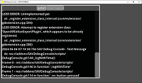
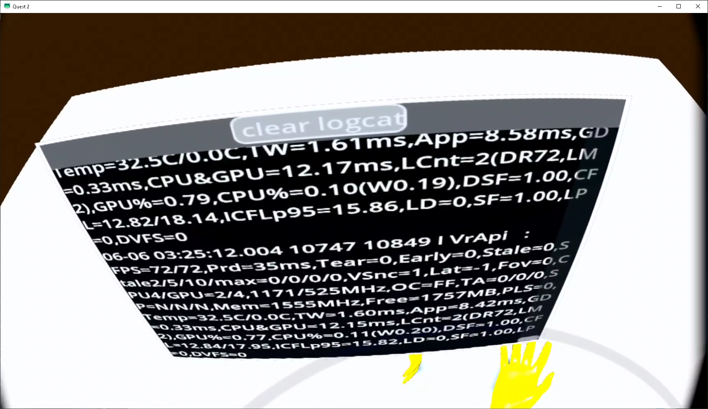

# SAVDebugConsole-GODOT
---

&nbsp;

&nbsp;

Runtime ("in app") Debug Console for GODOT

Works with both GODOT logs and Android Logcat output

SAV Debug Console is a flexible and light weight GDScript that creates a runtime debug console display that you can add to almost any GODOT application

Display at runtime ("in app") the log output from the print, print_debug and print_stack  methods or logcat

SAV Debug Console is a work in progress

GODOT Build 4.2

&nbsp;

# Features:
- GDScript supports all GODOT platforms
- Supports XR (AR/VR)
- Logcat support for Android (Mobile, Quest, etc. * see know issues)
- Clear logcat button
- Logcat color support
- Scrollable window
- Static logging methods included
	- logcat or print
	- Entries are date and time stamped with milliseconds
- Light weight and fast
- Easy to use and modify

&nbsp;

# Required for XR:
godot-xr-tools
* check https://github.com/GodotVR/godot-xr-tools for updates

&nbsp;

# Quick Start:
Other than XR:
1. Instantiate Child Scene
2. Search for and Open the SAVDebugConsole scene (addons\SAVDebugConsole\scenes\SAVDebugConsole.tscn)

XR:
1. Add a Viewport2Din3D2 (godot-xr-tools)
2. Locate the SAVDebugConsole scene (addons\SAVDebugConsole\scenes\SAVDebugConsole.tscn)
3. Drag the SAVDebugConsole scene in to Viewport2Din3D2's Content/scene

&nbsp;

# Examples scenes:
Other than XR: 
addons\SAVDebugConsole\examples\scenes\SAVDebugConsoleExample.tscn
* if your getting an XR error, Disable OpenXR in the Project Settings

XR: 
addons\SAVDebugConsole\examples\scenes\QuestExample.tscn
* Enable OpenXR in the Project Settings
* Enable godot-xr-tools
	* check https://github.com/GodotVR/godot-xr-tools for updates

&nbsp;

# Settings:
Other than XR:
1. Located in the inspector for the SAVDebugConsole element

XR:
1. In the Viewport2Din3D2's Content/scene, Click the "Open Scene" 
2. Adjust in the inspector for the SAVDebugConsole element

 
Both: 

Console Entries Max : int = 100
- max number of entries in the list
	- console_entries_max above 100 can cause performance issues
	- must be an integer > 0

&nbsp;

Logcat : bool = false
- Display GODOT logs and logcat output
	- True = logcat logs

&nbsp;

Logcat variables : String = "\-v, color "
- Additional variables to pass to logcat
- Default value shows colored entries
- Currently we use a slightly different format than regular command line options
	- Our parser requires a comma and space (", ") to separate command line options from their parameters.
- Usage as indicated in the logcat manual with a comma and space separating the command line option from its parameters
	- \-s, \<tag1\>,\<tag2\>
		- Silence all tags but the 2 tags indicated
		- Example: 
			- \-v, color, \-s, SAVDebugConsole godot
				- comma between the tags in this case is optional
			- \-v, color, \-s, VrApi,PerformanceManager_ZSF
				- Quest users see https://developer.oculus.com/documentation/native/android/ts-logcat/
	- \<tag1\>:D \<tag2\>:E *:S 
		- Silence all tags but Debug messages from tag1 and Error messages from tag2
		- Example: 
			- \-v, color, SAVDebugConsole:D godot:E *:S
	- Replace \<tag\> with the tag string
	- Character formatting for spaces or no spaces after commas matter
	- Due to how our parsing works a space after commas is required for command line parameters
	- One more set of examples of how to show a brief logcat with color
		- \-v, color brief, \-s, SAVDebugConsole godot 
		- \-v, color,brief, \-s, SAVDebugConsole,godot
		- \-v, color brief, \-s, SAVDebugConsole,godot
		- \-v, color,brief, \-s, SAVDebugConsole godot
		- add more options etc.
	- Not all command line options are tested or supported
		- See: https://developer.android.com/tools/logcat

&nbsp;

Runtime Filter
- Click on the magnifying glass to open the "Filter Properties" entry
- Type in the filter term
- Matches display rows

&nbsp;

Print and Log replacements:

_SAVDebugConsole

	static func Print(message: String, level: LogLevel = LogLevel.INFO,  stack: String = "") -> void:

	static func Log(tag : String, message : String, level : LogLevel = LogLevel.INFO) -> void:

- Eamples:
	- _SAVDebugConsole.Print("This is a debug print log entry", LogLevel.DEBUG)
	- _SAVDebugConsole.Log("SAVDebugConsole", "This is a warning logcat log entry", LogLevel.WARN)

- The following characters must be escaped
	- ` (single quote)
		- Example:
			- "A single quote \\' is encoded like this"
				- A single quote ' is encoded like this
	- \ (back slash)
		- Example:
			- "A single back slash \\\\\\\\ is encoded like this"
				- A single back slash \\ is encoded like this
		
&nbsp;

# Known issues:
Some Android phones use buffering. This can appear a no logging or logging partial entries.
- Next versionish will contain a legacy method for dealing with this
- Future version may be able to use a stdout update planned for GODOT

Unknown behavior if GODOT log rotates