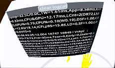

# SAVDebugConsole-GODOT
---

&nbsp;

&nbsp;

Runtime ("in app") Debug Console for GODOT

Works with both GODOT logs and Android Logcat output

SAV Debug Console is a flexible and light weight GDScript that creates a runtime debug console display that you can add to almost any GODOT application

Display at runtime ("in app") the log output from the print, print_debug and print_stack  methods or logcat

SAV Debug Console is a work in progress

GODOT Build 4.2

&nbsp;

# Features:
- GDScript supports all GODOT platforms
- Support XR (AR/VR)
- Android support for logcat
- Clear logcat button
- Scrollable window
- Built in GODOT log entry generator
	- Entries are date and time stamped with milliseconds
	- Include Stack Trace
- Light weight and fast
- Easy to use and modify

&nbsp;

# Quick Start:
Other than XR:
1. Instantiate Child Scene
2. Search for and Open SAVDebugConsole (addons\SAVDebugConsole\scenes\SAVDebugConsole.tscn)

XR:
1. Add a Viewport2Din3D2 (godot-xr-tools)
2. Locate SAVDebugConsole (addons\SAVDebugConsole\scenes\SAVDebugConsole.tscn)
3. Drag in to Viewport2Din3D2's Content/scene

&nbsp;

# Examples scenes:
Other than XR: 
addons\SAVDebugConsole\examples\scenes\SAVDebugConsoleExample.tscn

XR: 
addons\SAVDebugConsole\examples\scenes\QuestExample.tscn

&nbsp;

# Settings:
Other than XR:
1. Located in the inspector for the SAVDebugConsole element

XR:
1. In the Viewport2Din3D2's Content/scene, Click the "Open Scene" 
2. Adjust in the inspector for the SAVDebugConsole element

 
Both: 

Console Entries Max : int = 100
- max number of entries in the list
	- console_entries_max above 100 can cause performance issues
	- must be an integer > 0

Logcat : bool = false
- Switch between GODOT logs and logcat output
	- True = logcat logs

&nbsp;

# Known issues:

Some messages are displayed partially

Hard to scroll when new logcat entries cause scroll to the bottom

Unknown behavior if GODOT log rotates